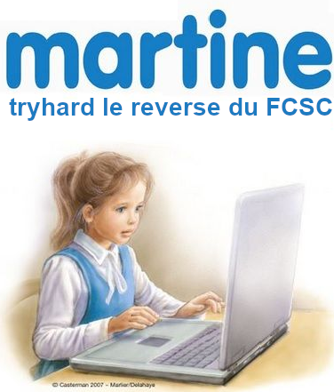

# FCSC 2023 Contrôleur de licence

C’est l’histoire de Martine. Martine a retrouvé son premier ordinateur. Le système d’exploitation demande à Martine sa clé de série. Peux-tu l’aider ?

Fichiers:
- [controleur-de-licence.exe](https://hackropole.fr/challenges/fcsc2023-reverse-controleur-de-licence/public/controleur-de-licence.exe)  (Application, pouvant être interprétée comme un virus par certains antivirus)

Auteur : sheidan

Origine : [Contrôleur de licence](https://hackropole.fr/fr/challenges/reverse/fcsc2023-reverse-controleur-de-licence/)

-----------

## Installation manuel
Vous n'utilisez pas l'application **les CTFs de Cyrhades** ? C'est dommage !
Mais voici comment installer ce CTF manuellement :

> git clone https://github.com/Hack-Oeil/fcsc2023-reverse-controleur-de-licence.git

> cd fcsc2023-reverse-controleur-de-licence

-----------

## Sur le site officiel hackropole.fr
> https://hackropole.fr/fr/challenges/reverse/fcsc2023-reverse-controleur-de-licence/